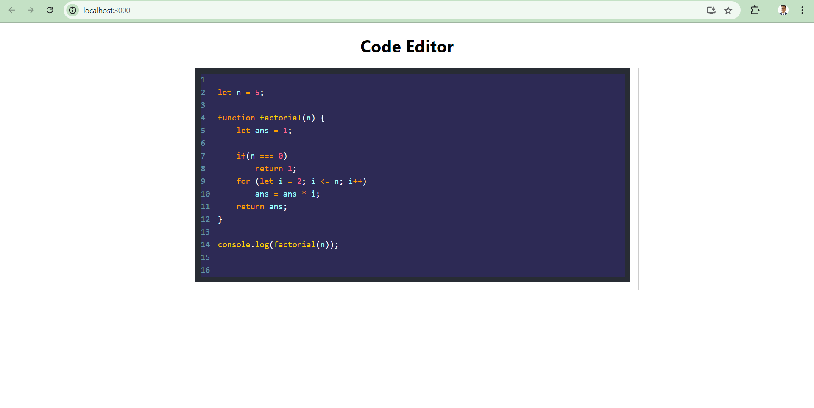

# Getting Started with Create React App

This project was bootstrapped with [Create React App](https://github.com/facebook/create-react-app).

## Available Scripts

In the project directory, you can run:

### `npm start`

Runs the app in the development mode.\
Open [http://localhost:3000](http://localhost:3000) to view it in your browser.

# Simple Code Editor

## Project Objective
Develop a simple web-based code editor using React, with syntax highlighting capabilities provided by PrismJS.

## Features
- **Text Input**: Users can input and edit code in a textarea element.
- **Syntax Highlighting**: The inputted code will be automatically highlighted using PrismJS.
- **Language Support**: Initial support for JavaScript with potential to extend to other languages.

## Technology Stack
- **Frontend Framework**: React
- **Syntax Highlighting**: PrismJS and prism-react-renderer
- **Styling**: CSS

## Key Components
- **CodeEditor Component**: 
  - Handles user input via a textarea.
  - Displays syntax-highlighted code using PrismJS.

---